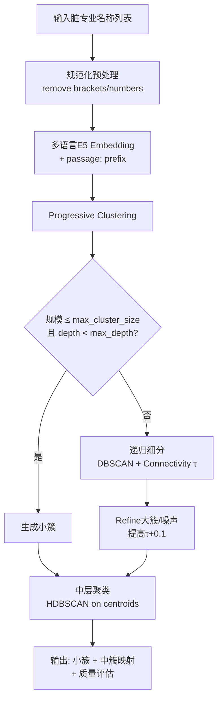
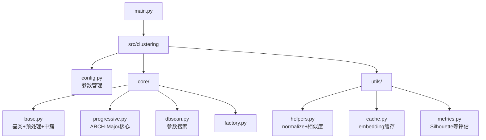

# ARCH-Major Clustering

[](https://www.python.org/)
[](LICENSE)
[](https://huggingface.co/intfloat/multilingual-e5-large-instruct)

**ARCH-Major** 是一个专为教育领域专业名称脏数据设计的自适应递归聚类系统。通过语义嵌入 + DBSCAN + 递归连通性分析 + 中层簇合并，实现无需人工规则或花名册的高质量自动分类。

针对“计算机科学与技术”、“软件工程”、“电脑应用”等大量同义/噪声变体，系统能稳定生成教育专业大类、中类和小类。

---

## 核心算法：ARCH-Major

基于论文伪代码 **Adaptive Recursive Clustering Algorithm** 实现：



**关键优化**：
- **预处理**：规范化括号、编号、特殊字符，减少噪声
- **自适应**：动态eps/min_samples + 连通组件 + 递归深度控制
- **中层合并**：默认HDBSCAN对簇心二次聚类，形成教育“专业大类”
- **质量控制**：Silhouette、Davies-Bouldin、类内相似度、噪声比例

---

## 快速开始

### 1. 安装

```powershell
# Windows推荐
python -m venv .venv
.venv\Scripts\activate.ps1
pip install -r requirements.txt
```

### 2. 运行

```powershell
# 基础使用（默认progressive算法）
python main.py data/input.xlsx output/results.xlsx --visualize

# 指定算法
python main.py data/input.xlsx output/results.xlsx --algorithm dbscan
```

**输入**：Excel文件，包含`major_1`列的专业名称（支持脏数据）  
**输出**：`results.xlsx`（cluster_id, text, middle_cluster_id） + 可视化报告

---

## 配置参数（config.yaml）

```yaml
connectivity_threshold: 0.58      # 连通性阈值（教育数据推荐0.55-0.62）
min_similarity_threshold: 0.52
max_cluster_size: 45              # 单个小簇上限
max_depth: 5
middle_method: hdbscan            # 中层聚类推荐hdbscan
middle_connectivity_threshold: 0.55
embedding_prefix: "passage: "
```

**主要参数说明**：

| 参数 | 作用 | 推荐值（教育脏数据） | 说明 |
|------|------|---------------------|------|
| connectivity_threshold | 图连通阈值 | 0.58 | 越高簇越紧 |
| max_cluster_size | 小簇上限 | 45 | 避免过大类 |
| middle_method | 中层算法 | hdbscan | 自动处理噪声 |
| embedding_prefix | E5指令 | passage: | 显著提升中文效果 |

---

## 项目结构



---

## 优势

- **专为脏数据设计**：规范化 + 语义嵌入有效处理同义变体
- **无监督**：无需标注或人工花名册
- **可解释**：中簇映射 + 可视化报告
- **高效**：缓存 + 动态参数，适合数千条教育专业数据
- **可扩展**：支持DBSCAN/Progressive切换，易添加新模型

当前默认使用 `intfloat/multilingual-e5-large-instruct`，对中英文教育文本效果最佳。

---

## 许可证

MIT License

---

**作者**：基于ARCH-Major伪代码实现  
**参考**：`docs/algorithms/ARCH-Major-Algorithm.pdf`

如需自定义专业ontology映射或进一步性能优化，请提供具体数据样本。
```