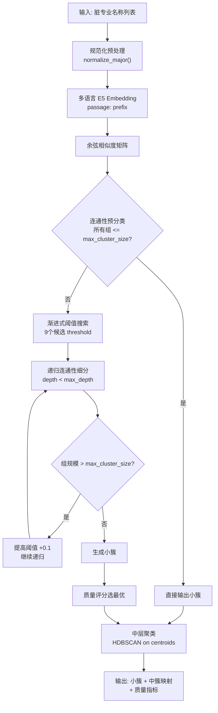

# ARCH-Major Clustering

[](https://www.python.org/)
[](LICENSE)
[](https://huggingface.co/intfloat/multilingual-e5-large-instruct)

**ARCH-Major**（Adaptive Recursive Clustering with Hierarchical Merging）是一个专为教育领域专业名称脏数据设计的自适应递归聚类系统。通过语义嵌入 + 连通性图分析 + 递归细分 + 中层簇合并，实现无需人工规则或花名册的高质量自动分类。

针对"计算机科学与技术"、"软件工程"、"电脑应用"等大量同义/噪声变体，系统能稳定生成教育专业的**小类**（语义紧密簇）和**大类**（中层簇心聚类）。

---

## 算法概述

基于自研 **ARCH-Major** 伪代码（见 `docs/algorithms/ARCH-Major-Algorithm.pdf`）实现：



### 核心流程

1. **预处理**：`normalize_major()` 去除括号、编号、特殊字符，减少噪声变体
2. **语义嵌入**：使用 `intfloat/multilingual-e5-large-instruct` + `passage:` 指令前缀，生成高质量中英文向量
3. **连通性预分类**：以 `connectivity_threshold` 构建图，若连通分量均小于 `max_cluster_size` 则直接输出
4. **渐进式递归细分**：对预分类失败的数据，在阈值搜索范围内递归构建连通分量，超大组自动提高阈值继续拆分
5. **质量评分**：综合类内相似度（0.35）+ 类间差异度（0.25）+ 噪声比例（0.20）+ 大小均匀性（0.20）选取最优结果
6. **中层聚类**：对小簇簇心做 HDBSCAN 二次聚类，形成教育"专业大类"

### 与传统方法对比

| 特性 | ARCH-Major | 纯 DBSCAN | K-Means |
|------|-----------|-----------|---------|
| 无需预设簇数 | Y | Y | N |
| 处理噪声/离群点 | Y | Y | N |
| 自适应参数 | Y | N | N |
| 递归细分大簇 | Y | N | N |
| 层级输出（小类+大类） | Y | N | N |

---

## 快速开始

### 1. 安装

```powershell
python -m venv .venv
.venv\Scripts\activate.ps1
pip install -r requirements.txt
```

### 2. 运行

```powershell
# 默认使用 progressive 算法（推荐）
python main.py data/input.xlsx output/results.xlsx

# 生成可视化报告
python main.py data/input.xlsx output/results.xlsx --visualize

# 使用纯 DBSCAN 网格搜索
python main.py data/input.xlsx output/results.xlsx --algorithm dbscan

# 指定模型和配置
python main.py data/input.xlsx output/results.xlsx --model_name intfloat/multilingual-e5-large-instruct --config config.yaml
```

**输入**：Excel 文件，包含 `major_1` 列的专业名称（支持脏数据）  
**输出**：`results.xlsx`（cluster_id, text, middle_cluster_id）+ 可视化报告（t-SNE / PCA 散点图 + 簇大小分布）

---

## 配置参数（config.yaml）

```yaml
connectivity_threshold: 0.58      # 连通性阈值
min_similarity_threshold: 0.52    # 最小相似度阈值
max_cluster_size: 45              # 单个小簇上限
max_depth: 5                      # 递归最大深度
middle_method: hdbscan            # 中层聚类方法
middle_connectivity_threshold: 0.55
embedding_prefix: "passage: "     # E5 指令前缀
```

| 参数 | 作用 | 推荐值 | 说明 |
|------|------|--------|------|
| `connectivity_threshold` | 图连通阈值 | 0.55-0.62 | 越高簇越紧，过高导致碎片化 |
| `max_cluster_size` | 小簇上限 | 30-60 | 控制单簇最大规模 |
| `max_depth` | 递归深度 | 3-6 | 防止过度拆分 |
| `middle_method` | 中层算法 | hdbscan | 可选 threshold / modularity / hdbscan / kmeans |
| `embedding_prefix` | E5 指令 | `passage: ` | 对 E5-Instruct 系列模型显著提升效果 |

---

## 项目结构

```
arch-major-clustering-master/
|-- main.py                          # CLI 入口
|-- config.yaml                      # 默认配置
|-- requirements.txt                 # 依赖
|-- docs/
|   `-- algorithms/
|       `-- ARCH-Major-Algorithm.pdf # 算法伪代码
|-- src/clustering/
|   |-- __init__.py
|   |-- config.py                    # ClusteringConfig dataclass
|   |-- core/
|   |   |-- base.py                  # 基类：嵌入、相似度、中层聚类
|   |   |-- progressive.py           # ARCH-Major 核心实现
|   |   |-- dbscan.py                # DBSCAN 网格搜索实现
|   |   `-- factory.py               # 算法工厂
|   `-- utils/
|       |-- helpers.py               # 预处理、相似度矩阵计算
|       |-- cache.py                 # Embedding 磁盘缓存
|       |-- metrics.py               # Silhouette / DB / CH 评估
|       |-- visualization.py         # t-SNE/PCA 可视化
|       |-- logging.py               # 日志
|       `-- exceptions.py            # 自定义异常
`-- tests/
    |-- test_config.py
    |-- test_helpers.py
    `-- test_cache.py
```

---

## 两种算法模式

### Progressive（推荐）

即 ARCH-Major 核心算法。通过连通性图递归细分 + 多阈值扫描实现自适应聚类，适合脏数据和不规则分布。

### DBSCAN

在 `(eps, min_samples)` 参数空间上网格搜索，根据类内相似度 + 噪声比例 + 大小均匀性选取最优参数组合。适合作为基线对比。

---

## 评估指标

系统自动输出以下聚类质量指标：

| 指标 | 含义 | 理想方向 |
|------|------|----------|
| Silhouette Score | 簇内紧密度 vs 簇间分离度 | 越大越好（[-1, 1]） |
| Davies-Bouldin Index | 簇间重叠程度 | 越小越好 |
| Calinski-Harabasz Index | 方差比准则 | 越大越好 |
| Noise Ratio | 噪声点占比 | 越小越好 |

---

## 许可证

MIT License

---

**作者**：Jiapeng Li  
**算法参考**：`docs/algorithms/ARCH-Major-Algorithm.pdf`
